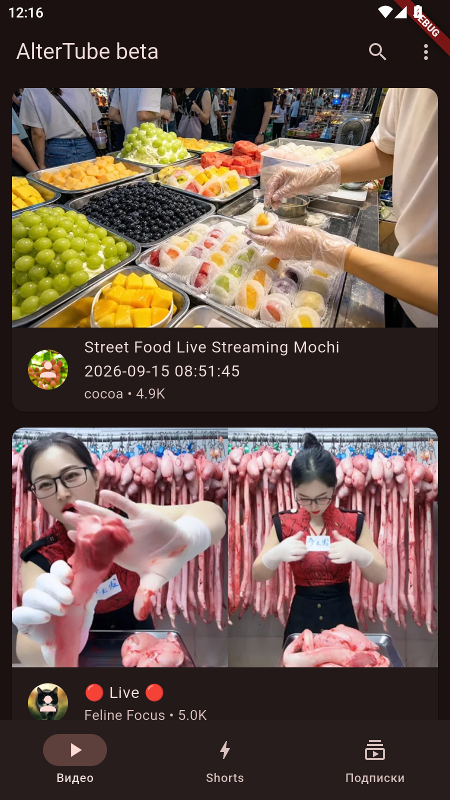
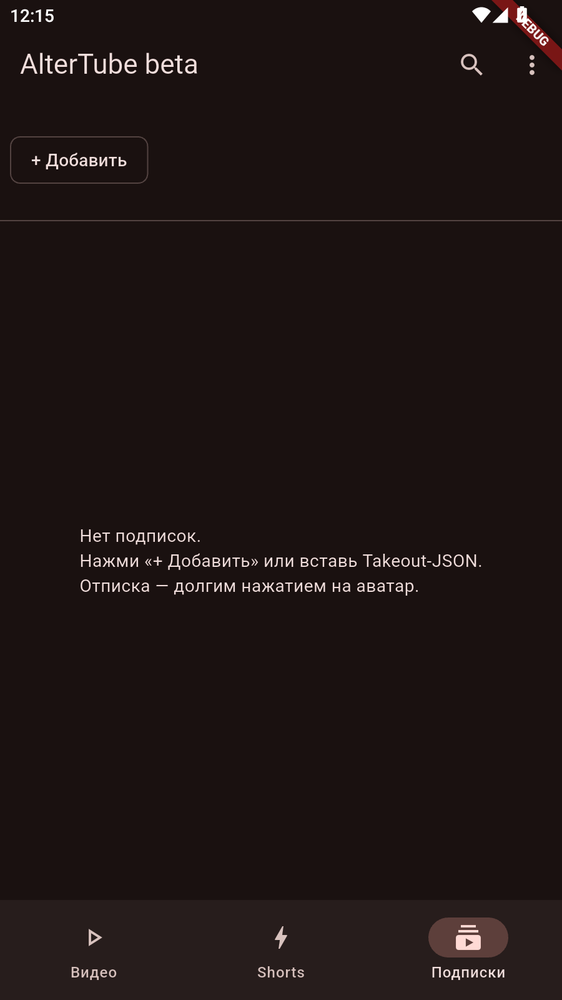

# AlterTube — 0.4.0 beta


Лёгкий YouTube-клиент без Google-входа и без рекламы: отдельно **Видео**, отдельно
**Shorts**, отдельно **Подписки** + **Библиотека** с историей. Подписки и история хранятся
только на телефоне. Спонсорские вставки пропускаются автоматически (SponsorBlock).

| Лента | Подписки |
|---|---|
|  |  |

> ⚠️ Честный дисклеймер: это форк-подход в духе NewPipe / PipePipe — используется
> reverse-engineered экстрактор, а не официальный YouTube API. Это нарушает правила YouTube:
> после их обновлений что-то может временно сломаться, возможны ограничения по IP.
> В Play Market не публикуемся — только GitHub. Рекламы нет по дизайну: видео играют
> напрямую в нашем плеере.

## Установка (без сборки, за 2 минуты)

1. Открой вкладку **Actions** → самый верхний успешный **Build debug APK**.
2. Внизу страницы скачай артефакт **altertube-debug** (это zip, внутри `app-debug.apk`).
3. Перекинь APK на телефон / в эмулятор и установи (разреши «установку из неизвестных источников»).
4. Готово — вход никуда не нужен.

## Как пользоваться

- **Видео** — лента трендов. Если есть подписки, сверху сначала свежее с твоих каналов
  (чем чаще смотришь канал, тем он выше), дальше тренды. Фильтры: Все / Непросмотренные /
  С подписок. Просмотренное приглушается. Кнопка ↑ возвращает наверх.
- **Shorts** — вертикальная лента. Тап — пауза/плей, кнопка справа открывает шортс как
  обычное видео. Автопрокрутка к следующему включается в настройках.
- **Подписки** — сверху полоса каналов, ниже их свежие видео. Добавить: кнопка **+** →
  вставь ссылку, `@handle`, UC-id или название канала. Отписаться: долгое нажатие на аватар.
  Массовый переезд из NewPipe / Google — см. [перенос подписок](docs/IMPORT.md).
- **Библиотека** — история просмотров (последние 100), быстрый доступ к настройкам.
- **Поиск** (лупа сверху) — помнит последние 20 запросов, помечает Shorts молнией.
- **Плеер** — качество, скорость 0.5–2.0, главы-чипы, комментарии, похожие видео,
  кнопка «Подписаться» прямо под названием канала. Скорость и пауза сохраняются
  при смене качества.

## Настройки (меню ⋮ → Настройки)

- **Внешний вид** — системная / светлая / тёмная тема + чисто чёрный AMOLED-режим.
- **Контент → Регион** — влияет на тренды и поиск (auto / RU / UA / US / DE).
- **Лента под подписки** — выключи, чтобы видеть только чистые тренды.
- **SponsorBlock** — какие сегменты пропускать (спонсор, самопиар, интро, концовка и т.д.).
  Работает сразу, без настройки. Опционально можно указать свой Flask-компаньон
  (кэширует ответы SponsorBlock в локальной сети).
- **Данные** — удалить подписки / очистить историю / сбросить всё.

## Если что-то не работает

| Симптом | Что делать |
|---|---|
| «YouTube ограничил запросы (429)» | Подожди минуту и потяни ленту вниз для обновления |
| «Нет сети» | Проверь интернет в эмуляторе/телефоне, кнопка «Повторить» |
| «Экстрактор сломался» | YouTube что-то поменял — загляни в Actions, обычно чинится обновлением экстрактора |
| Пустая лента подписок | У каналов-«топиков» бывает нет видеоленты — это нормально и в NewPipe |
| Краш на старом Android | Патч экстрактора уже встроен (см. «Для разработчиков»), минимум — Android 5.0 |

## Для разработчиков

Стек: Flutter/Dart (Material 3) + `newpipeextractor_dart` (Android-only) + плеер `media_kit`.
Python — только скрипты сборки, Flask — опциональный кэш SponsorBlock.

```
app/lib/
  main.dart  app.dart                    # точка входа, 4 таба, темы
  core/theme/app_theme.dart             # светлая / тёмная / AMOLED
  core/widgets/                         # VideoCard, ChannelAvatar, AppErrorView, скелетоны
  core/extractor/extractor_service.dart # тренды/поиск/потоки/комменты/каналы + тексты ошибок
  core/sponsorblock/sponsorblock_service.dart
  core/subs/subscriptions_repository.dart   # локальные подписки + импорт NewPipe/Takeout/CSV
  core/history/history_repository.dart      # последние 100 + индекс интересов (affinity)
  core/settings/app_settings.dart           # тема, регион, SB, backend (SharedPreferences)
  features/videos/ shorts/ subs/ library/ player/ search/ settings/
backend/app.py         # Flask: /health /sb/skipSegments (кэш 30 мин) /subs
tools/build.py         # check | run | apk | backend | takeout
tools/parse_takeout.py # Takeout subscriptions.json -> app_subs.json / NewPipe-json
tools/patch_extractor.py # пересборка NewPipeExtractor.jar с фиксом для Android <13
```

Сборка в облаке (рекомендуется): любой пуш в `main` → Actions → артефакт `altertube-debug`.
Локально: `cd app && flutter pub get && flutter analyze && flutter build apk --debug`
(после `pub get` нужен патч `flutter_inappwebview_android`, см. `tools/build.py::patch_pubcache` —
в CI он применяется автоматически).

Известный нюанс: NewPipeExtractor v0.26.5 вызывает `URLEncoder.encode(String, Charset)`
(есть только с API 33). Upstream-фикс в релизах отсутствует, поэтому в репозитории лежит
пересобранный `app/android/app/libs/NewPipeExtractor-v0.26.5-altertube.jar`, а оригинальный
артефакт исключён в `build.gradle.kts`. При обновлении экстрактора: обновить тег
в `tools/patch_extractor.py`, пересобрать jar, закоммитить.

Статус и планы — в [docs/ALPHA.md](docs/ALPHA.md).

## Благодарности

- NewPipe + NewPipeExtractor (GPL-3.0) — идея и протокол извлечения
- PipePipe (GPL-3.0) — SABR-исследования, SponsorBlock как референс
- SponsorBlock `sponsor.ajay.app` — пропуск сегментов
- `newpipeextractor_dart` — Flutter-обёртка экстрактора

Форк обязан оставаться под **GPL-3.0**, см. `LICENSE`.
